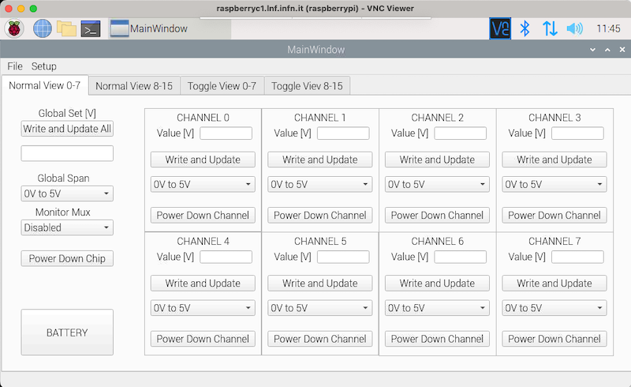

# 16chsPs
## 16 Channels DAC based Low Noise Power Supply ##

The repository contains the software developed to manage the **16 Channels DAC System for Junctions Power Supply**. 
The software has been developed in python and is based on a PyQt GUI that allows 
to manage the main features of the system. A picture of the contro GUI is shown below while a more complete description of the power supply can be found [here](https://www.giuliettofelici.it/16-chs-low-noise-ps/)

